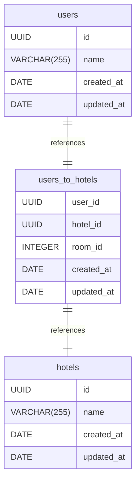

# hrbs-db-schema documentation
## Summary

- [Introduction](#introduction)
- [Database Type](#database-type)
- [Table Structure](#table-structure)
	- [hotels](#hotels)
	- [users](#users)
	- [users_to_hotels](#users_to_hotels)
- [Relationships](#relationships)
- [Database Diagram](#database-diagram)

## Introduction

## Database type

- **Database system:** PostgreSQL
## Table structure

### hotels

| Name        | Type          | Settings                      | References                    | Note                           |
|-------------|---------------|-------------------------------|-------------------------------|--------------------------------|
| **id** | UUID | 🔑 PK, not null, unique |  | |
| **name** | VARCHAR(255) | not null |  | |
| **created_at** | DATE | not null |  | |
| **updated_at** | DATE | not null |  | | 

### users

| Name        | Type          | Settings                      | References                    | Note                           |
|-------------|---------------|-------------------------------|-------------------------------|--------------------------------|
| **id** | UUID | 🔑 PK, not null, unique | fk_users_id_users_hotels | |
| **name** | VARCHAR(255) | not null |  | |
| **created_at** | DATE | not null |  | |
| **updated_at** | DATE | not null |  | | 

### users_to_hotels

| Name        | Type          | Settings                      | References                    | Note                           |
|-------------|---------------|-------------------------------|-------------------------------|--------------------------------|
| **user_id** | UUID | 🔑 PK, not null, unique |  | |
| **hotel_id** | UUID | 🔑 PK, not null | fk_users_hotels_hotel_id_hotels | |
| **room_id** | INTEGER | not null |  | |
| **created_at** | DATE | not null |  | |
| **updated_at** | DATE | not null |  | | 

## Relationships

- **users to users_to_hotels**: one_to_one
- **users_to_hotels to hotels**: one_to_one

## Database Diagram

