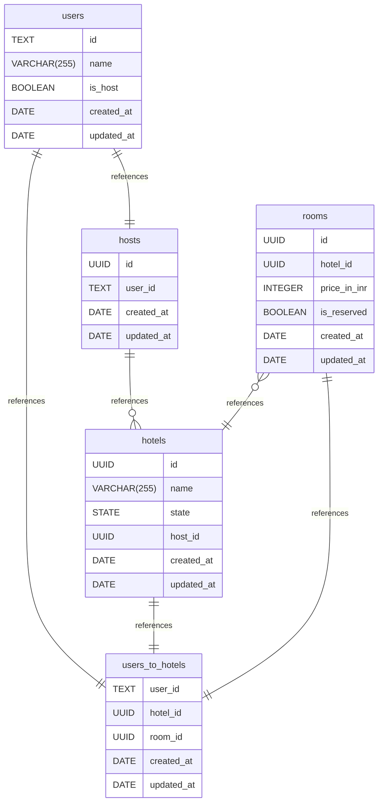

# hrbs documentation
## Summary

- [Introduction](#introduction)
- [Database Type](#database-type)
- [Table Structure](#table-structure)
	- [users](#users)
	- [hotels](#hotels)
	- [users_to_hotels](#users_to_hotels)
	- [rooms](#rooms)
	- [hosts](#hosts)
- [Relationships](#relationships)
- [Database Diagram](#database-diagram)

## Introduction

## Database type

- **Database system:** PostgreSQL
## Table structure

### users

| Name        | Type          | Settings                      | References                    | Note                           |
|-------------|---------------|-------------------------------|-------------------------------|--------------------------------|
| **id** | TEXT | 🔑 PK, not null, unique | fk_users_id_users_to_hostels,fk_users_id_hosts | |
| **name** | VARCHAR(255) | not null |  | |
| **is_host** | BOOLEAN | not null, default: FALSE |  | |
| **created_at** | DATE | not null |  | |
| **updated_at** | DATE | not null |  | | 

### hotels

| Name        | Type          | Settings                      | References                    | Note                           |
|-------------|---------------|-------------------------------|-------------------------------|--------------------------------|
| **id** | UUID | 🔑 PK, not null, unique | fk_hotels_id_users_to_hostels | |
| **name** | VARCHAR(255) | not null |  | |
| **state** | STATE | not null |  | |
| **host_id** | UUID | not null |  | |
| **created_at** | DATE | not null |  | |
| **updated_at** | DATE | not null |  | | 

### users_to_hotels

| Name        | Type          | Settings                      | References                    | Note                           |
|-------------|---------------|-------------------------------|-------------------------------|--------------------------------|
| **user_id** | TEXT | 🔑 PK, not null, unique |  | |
| **hotel_id** | UUID | 🔑 PK, not null |  | |
| **room_id** | UUID | not null |  | |
| **created_at** | DATE | not null |  | |
| **updated_at** | DATE | not null |  | | 

### rooms

| Name        | Type          | Settings                      | References                    | Note                           |
|-------------|---------------|-------------------------------|-------------------------------|--------------------------------|
| **id** | UUID | 🔑 PK, not null, unique | fk_rooms_id_users_to_hostels | |
| **hotel_id** | UUID | not null | fk_rooms_hotel_id_hotels | |
| **price_in_inr** | INTEGER | not null |  | |
| **is_reserved** | BOOLEAN | not null, default: FALSE |  | |
| **created_at** | DATE | not null |  | |
| **updated_at** | DATE | not null |  | | 

### hosts

| Name        | Type          | Settings                      | References                    | Note                           |
|-------------|---------------|-------------------------------|-------------------------------|--------------------------------|
| **id** | UUID | 🔑 PK, not null, unique | fk_hosts_id_hotels | |
| **user_id** | TEXT | not null |  | |
| **created_at** | DATE | not null |  | |
| **updated_at** | DATE | not null |  | | 

## Relationships

- **users to users_to_hotels**: one_to_one
- **hotels to users_to_hotels**: one_to_one
- **rooms to users_to_hotels**: one_to_one
- **hosts to hotels**: one_to_many
- **rooms to hotels**: many_to_one
- **users to hosts**: one_to_one

## Database Diagram

