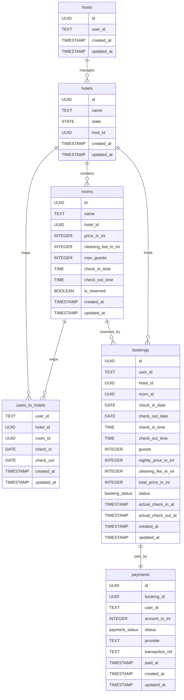

# hrbs documentation

## Summary

- [Introduction](#introduction)
- [Database Type](#database-type)
- [Table Structure](#table-structure)
  - [hotels](#hotels)
  - [users_to_hotels](#users_to_hotels)
  - [rooms](#rooms)
  - [hosts](#hosts)
  - [bookings](#bookings)
  - [payments](#payments)
- [Relationships](#relationships)
- [Database Diagram](#database-diagram)

## Introduction

This diagram covers only the application-owned schema. Better Auth manages the auth tables separately, so those tables are intentionally omitted here.

## Database type

- **Database system:** PostgreSQL

## Table structure

### hotels

| Name           | Type      | Settings                | References       | Note                                                 |
| -------------- | --------- | ----------------------- | ---------------- | ---------------------------------------------------- |
| **id**         | UUID      | 🔑 PK, not null, unique |                  |                                                      |
| **name**       | TEXT      | not null                |                  |                                                      |
| **state**      | STATE     | not null                |                  |                                                      |
| **host_id**    | UUID      | not null                | external host id | References a Better Auth user id via the hosts table |
| **created_at** | TIMESTAMP | not null                |                  |                                                      |
| **updated_at** | TIMESTAMP | not null                |                  |                                                      |

### users_to_hotels

| Name           | Type      | Settings        | References       | Note                             |
| -------------- | --------- | --------------- | ---------------- | -------------------------------- |
| **user_id**    | TEXT      | 🔑 PK, not null | external user id | References a Better Auth user id |
| **hotel_id**   | UUID      | 🔑 PK, not null | hotels.id        |                                  |
| **room_id**    | UUID      | not null        | rooms.id         |                                  |
| **check_in**   | DATE      | null            |                  |                                  |
| **check_out**  | DATE      | null            |                  |                                  |
| **created_at** | TIMESTAMP | not null        |                  |                                  |
| **updated_at** | TIMESTAMP | not null        |                  |                                  |

### rooms

| Name                    | Type      | Settings                    | References | Note |
| ----------------------- | --------- | --------------------------- | ---------- | ---- |
| **id**                  | UUID      | 🔑 PK, not null, unique     |            |      |
| **name**                | TEXT      | not null                    |            |      |
| **hotel_id**            | UUID      | not null                    | hotels.id  |      |
| **price_in_inr**        | INTEGER   | not null                    |            |      |
| **cleaning_fee_in_inr** | INTEGER   | not null, default: 0        |            |      |
| **max_guests**          | INTEGER   | not null, default: 2        |            |      |
| **check_in_time**       | TIME      | not null, default: 15:00:00 |            |      |
| **check_out_time**      | TIME      | not null, default: 11:00:00 |            |      |
| **is_reserved**         | BOOLEAN   | not null, default: FALSE    |            |      |
| **created_at**          | TIMESTAMP | not null                    |            |      |
| **updated_at**          | TIMESTAMP | not null                    |            |      |

### hosts

| Name           | Type      | Settings                | References       | Note                             |
| -------------- | --------- | ----------------------- | ---------------- | -------------------------------- |
| **id**         | UUID      | 🔑 PK, not null, unique |                  |                                  |
| **user_id**    | TEXT      | not null                | external user id | References a Better Auth user id |
| **created_at** | TIMESTAMP | not null                |                  |                                  |
| **updated_at** | TIMESTAMP | not null                |                  |                                  |

### bookings

| Name                     | Type           | Settings                     | References       | Note                             |
| ------------------------ | -------------- | ---------------------------- | ---------------- | -------------------------------- |
| **id**                   | UUID           | 🔑 PK, not null, unique      |                  |                                  |
| **user_id**              | TEXT           | not null                     | external user id | References a Better Auth user id |
| **hotel_id**             | UUID           | not null                     | hotels.id        |                                  |
| **room_id**              | UUID           | not null                     | rooms.id         |                                  |
| **check_in_date**        | DATE           | not null                     |                  |                                  |
| **check_out_date**       | DATE           | not null                     |                  |                                  |
| **check_in_time**        | TIME           | not null                     |                  |                                  |
| **check_out_time**       | TIME           | not null                     |                  |                                  |
| **guests**               | INTEGER        | not null, default: 1         |                  |                                  |
| **nightly_price_in_inr** | INTEGER        | not null                     |                  |                                  |
| **cleaning_fee_in_inr**  | INTEGER        | not null, default: 0         |                  |                                  |
| **total_price_in_inr**   | INTEGER        | not null                     |                  |                                  |
| **status**               | booking_status | not null, default: confirmed |                  |                                  |
| **actual_check_in_at**   | TIMESTAMP      | null                         |                  |                                  |
| **actual_check_out_at**  | TIMESTAMP      | null                         |                  |                                  |
| **created_at**           | TIMESTAMP      | not null                     |                  |                                  |
| **updated_at**           | TIMESTAMP      | not null                     |                  |                                  |

### payments

| Name                | Type           | Settings                   | References       | Note                             |
| ------------------- | -------------- | -------------------------- | ---------------- | -------------------------------- |
| **id**              | UUID           | 🔑 PK, not null, unique    |                  |                                  |
| **booking_id**      | UUID           | not null, unique           | bookings.id      |                                  |
| **user_id**         | TEXT           | not null                   | external user id | References a Better Auth user id |
| **amount_in_inr**   | INTEGER        | not null                   |                  |                                  |
| **status**          | payment_status | not null, default: pending |                  |                                  |
| **provider**        | TEXT           | null                       |                  |                                  |
| **transaction_ref** | TEXT           | null, unique               |                  |                                  |
| **paid_at**         | TIMESTAMP      | null                       |                  |                                  |
| **created_at**      | TIMESTAMP      | not null                   |                  |                                  |
| **updated_at**      | TIMESTAMP      | not null                   |                  |                                  |

## Relationships

- **hotels to rooms**: one_to_many
- **hotels to users_to_hotels**: one_to_many
- **rooms to users_to_hotels**: one_to_many
- **hotels to hosts**: many_to_one
- **rooms to bookings**: one_to_many
- **hotels to bookings**: one_to_many
- **bookings to payments**: one_to_one

## Database Diagram

